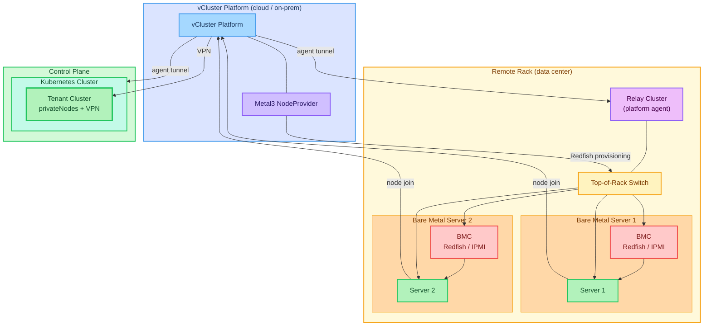
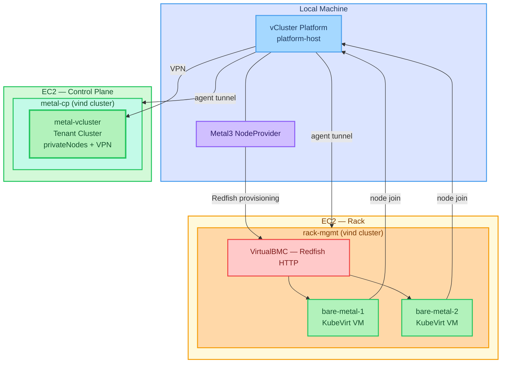

# vMetal VPN Demo

Demonstrates vCluster Platform provisioning bare-metal nodes in a remote rack, with the provisioned nodes joining a Tenant Cluster via the platform VPN.

## Architecture

vCluster Platform connects to a remote rack via a relay cluster running the platform agent. Metal3 provisions bare-metal servers over Redfish, and once booted the servers join a Tenant Cluster through the platform VPN.



## Prerequisites

- AWS credentials configured (`aws configure` or environment variables)
- An EC2 key pair; set `SSH_KEY_NAME` and `SSH_KEY_FILE` accordingly
- [OpenTofu](https://opentofu.org) — run `./scripts/setup.sh` to install
- [vcluster CLI](https://www.vcluster.com/docs/vcluster/next/getting-started/install-vcluster-cli)

## Full demo setup

Run these in order — each step waits for the previous to complete:

```bash
make platform-start    # start vCluster Platform locally (prompts for license token)
make rack-provision    # provision rack EC2, deploy KubeVirt VMs + VirtualBMC
make rack-connect      # connect rack to platform as rack-mgmt, deploy Metal3
make cp-start          # provision CP node EC2, create vind cluster, register as metal-cp
make node-vcluster     # create the vCluster — autoNodes provisions a bare metal node automatically
```

## Credits

The `kubevirt/` directory is largely based on [loft-sh/vcluster-bare-metal-with-kubevirt](https://github.com/loft-sh/vcluster-bare-metal-with-kubevirt), which provides the KubeVirt VM definitions, VirtualBMC setup, bridge/CNI manifests, and Helm chart structure. This repo adapts that work for an external rack scenario: splitting rack and BareMetalHost deployment, switching VirtualBMC from in-cluster HTTPS to HTTP NodePorts, and adding iptables forwarding for external BMC access.

## Teardown

```bash
make cp-down      # destroy CP node EC2
make rack-down    # destroy rack EC2
```

To tear down the platform, delete the `platform-host` vind cluster:

```bash
vcluster --driver docker delete platform-host
```

<details>
<summary>Demo setup (technical)</summary>

The demo simulates the above using EC2 instances and KubeVirt VMs instead of real hardware:

- **Bare metal servers** → KubeVirt VMs running inside a vind cluster on EC2
- **BMC (Redfish/IPMI)** → VirtualBMC exposed on HTTP NodePorts
- **Relay cluster** → `rack-mgmt` vind cluster on the rack EC2
- **Control plane cluster** → `metal-cp` vind cluster on a separate EC2



</details>
